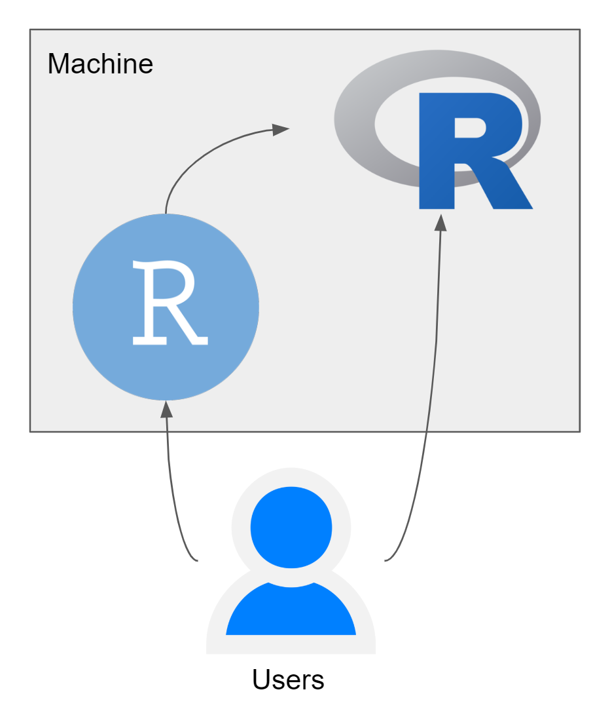
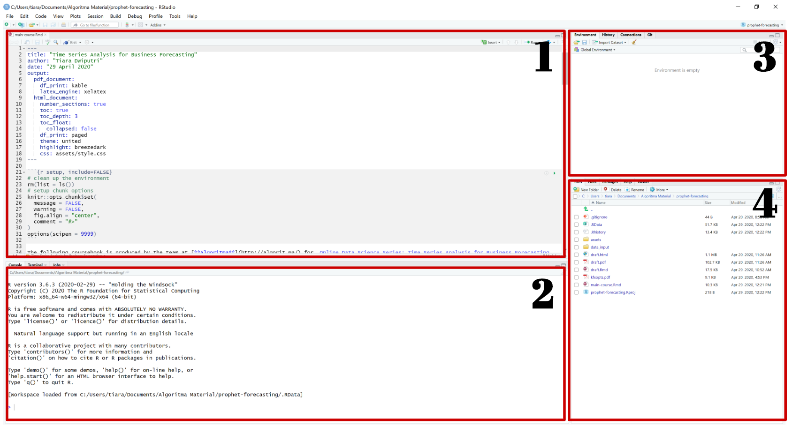
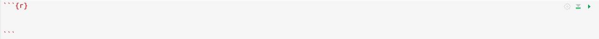
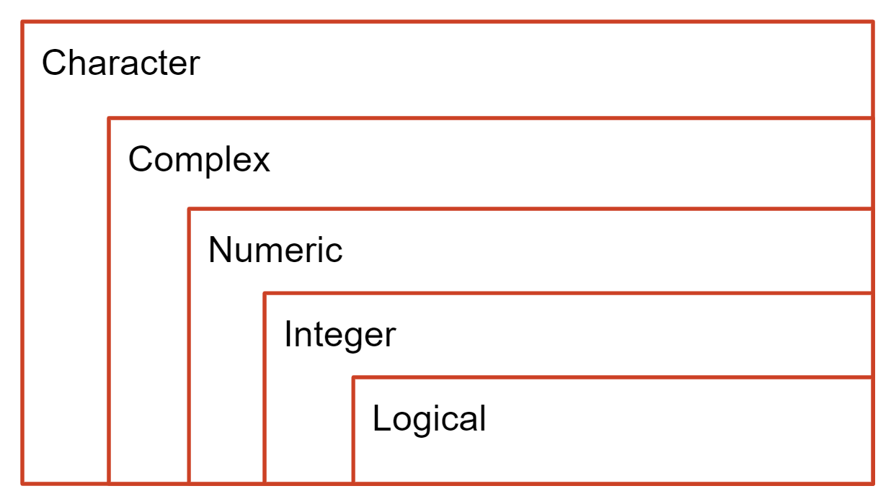

```{r setup, include=FALSE}
# clean up the environment
rm(list = ls())
# setup chunk options
knitr::opts_chunk$set(
  message = FALSE,
  warning = FALSE,
  fig.align = "center",
  comment = "#>"
)
options(scipen = 9999)

```


The following coursebook is the introductory part for _Online Data Science Series: Visualizing Geospatial Data in R_ workshop produced by the team at [**Algoritma**](http://algorit.ma/) . The coursebook is intended for a restricted audience only, i.e. the individuals having received this coursebook directly from the training organization. It may not be reproduced, distributed, translated or adapted in any form outside these individuals and organizations without permission.

[**Algoritma**](http://algorit.ma/) is a data science education center based in Jakarta. We organize workshops and training programs to help working professionals and students gain mastery in various data science sub-fields: data visualization, machine learning, data modeling, statistical inference, etc.

Before you go ahead and run the codes in this coursebook, it’s often a good idea to go through some initial setup. Under the **Training Objectives** section we’ll outline the syllabus, identify the key objectives and set up expectations for each module. Under the **Libraries and Setup** section you’ll see some code to initialize our workspace and the libraries we’ll be using for the projects. You may want to make sure that the libraries are installed beforehand by referring back to the packages listed here. 

# Preface {.tabset}

## Introduction

Geospatial data is data about objects, events, or phenomena that have a location on the surface of the earth. The data combines location information (usually coordinates on the earth), attribute information (the characteristics of the object, event, or phenomena concerned), and often also temporal information (the time or life span at which the location and attributes exist)[^1].

Geospatial analysis uses this data to build maps, graphs, statistics, and cartograms, making complex relationships understandable. It introduces a formal techniques using geographic and geometry properties of a data. There are various business problems that can be solved using geospatial analysis, namely a few:  

- Warehouse logistics optimization  
- Market growth analysis for different regions  
- Sales demand forecasting  
- Work resource management  

There are actually a plethora of tools that can visualize geographic information from full-scale GIS (Geographic Information System) applications such as [ArcGIS](https://www.arcgis.com/index.html) and [QGIS](https://qgis.org/en/site/) to web-based tools like [Google maps](http://maps.google.com/) to any number of programing languages. But, with advantages and disadvantages to these different types of tools, using a command-line interface has a steep learning curve, but it has the benefit of enabling approaches to analysis and visualization that are customizable, transparent, and reproducible[^2].

This 4-days online workshop is a beginner-friendly introduction to **Geospatial Analysis in R**. By visualizing geospatial data, users can have more intuitive decision making by contextualizing data in the real world, comparing informations across the city, state, or country.

## Training Objectives

This is the first online data science series course of _Geospatial Analysis in R_. The primary objective of this course is to provide a participant a comprehensive introduction about tools and software for visualizing a geospatial data using the popular open-source tools: R. The material will covers:

**Introductory Module:**

* **Tools Introduction**  
  + R and R Studio  
  + Open source packages  
  + Using R Markdown  
  + R Programming Basics  
* **Data Wrangling with R's `tidyverse`**  
  + Working with tabular data in R: Tips and Techniques 
  + Data Wrangling and Aggregation
  + Introduction to visualization with `ggplot2`
  
***
**Main Module:**

* **Building Indonesia Static Map**  
  - Retrieving Indonesia spatial vector from an open source provider
  - Working with spatial polygon in R
  - Grammar of Graphics for geospatial data using `ggplot2`
  - Enhancing map plots for richer visualization 
* **Creating Interactive Map**
  - Using `leaflet` - a JavaScript API for creating interactive maps
  - Adding markers and colors in `leaflet`
  - Building various geospatial analysis graphics: Heatmap, Choropleth, and Connection Map
* **Publishing your visualization**
  - Explore various publication options using `rmarkdown` versatile output 
  - Create an awesome and easy-to-build dashboard using `flexdashboard` package
  - Present your geospatial analysis for various industries business solution

## Library and Setup

In this **Library and Setup** section you’ll see some code to initialize our workspace, and the packages we’ll be using for this introductory session of this workshop. 

_Packages_ are collections of R functions, data, and compiled code in a well-defined format. The directory where packages are stored is called the _library_. R comes with a standard set of packages. Others are available for download and installation. Once installed, they have to be loaded into the session to be used. 

You will need to use `install.packages()` to install any packages that are not yet downloaded onto your machine. To install packages, type the command below on your console then press ENTER.

```{r eval=FALSE}
## DO NOT RUN CHUNK
packages <- c("tidyverse", "scales")

install.packages(packages)
```

Then you need to load the package into your workspace using the `library()` function. Special for this course, the _rmarkdown_ packages do not need to be called using `library()`.

```{r}
# package for data wrangling
library(dplyr)

# package for visualization
library(ggplot2)
library(scales)
```

# Introduction to R

## Why Learn R?

1. **Built by Statisticians, for Statisticians.**

  R is a statistical programming language created by Ross Ihaka and Robert Gentleman at the Department of Statistics, at the University of Auckland (New Zealand). R is created for data analysis and,as such,is different from traditional programming languages. [R](https://mran.revolutionanalytics.com/rro) is not just a statistical programming language, it is a complete environment for data analyst and the most widely used data analysis software today.

2. **Plentiful Libraries.**

  R provides numerous additional packages for which add out-of-the-box functionalities for various uses: statistical tests, time-series analysis, beautiful visualization, and various machine learning tasks such as regression algorithms, classification algorithms, and clustering algorithms. The R community is noted for its active contributions in terms of packages.

3. **Open Source.**

  Part of the reason for its active and rapidly growing community is the open-source nature of R. Users can contribute packages–many of which packaged some most advanced statistical tools and customized templates for visualization that is not found in other commercials, proprietary statistical computing software. In the first section of Library and Setup, we have prepared 4 main packages where 3 of them are developed by the R community.

4. **Used by The Biggest Software Companies in The World.**

  Dive deeper into R’s analytical capability, R has been used not only for descriptive analytics but also to develop machine learning and artificial intelligence project of major software companies in the world. 
 
5. **Ready for Big Data**

  `RHadoop`, `ParallelR`, Revolution R Enterprise, and a handful of other toolkits adds powerful big data support, allowing data engineers to create custom parallel and distributed algorithms to handle parallel / map-reduce programming in R. This makes R a popular choice for big data analytics and high performance, enterprise-level analytics platform.
 

## Navigating R Studio

Before we venture further into data analysis, we’ll take one step back to familiarize ourselves with the tools we will use. By now, you should be able to install **R** and **R Studio** in your machine. But what is the difference between the two? R and R Studio is a different application, and each has its role.

Not to be confused with R language, R Studio, is a supplementary application *made for streamlining the workflow of working with R*, this type of application is commonly known as _Integrated Development Environment_ (IDE) (See Fig. \@ref(fig:r-rstudio)). The application you are opening right now is called R Studio and under the hood, R Studio is communicating with an R session by sending the command on the chunk above through the *console* Window on the bottom of the application. If you strip down R Studio to its very core, really the R console on the bottom is the same one as R console when you open the original R application on your machine.

```{r r-rstudio, echo = FALSE, fig.align = "center",fig.width=7,fig.height=6, fig.cap="Relationship between R and RStudio"}

```

In the beginning of this chapter, we have discussed the main difference between R and R Studio. In R Studio, you might notice a few windows, if you’re reading this on R Markdown file, you’ll be looking at the *Source Pane* in R Studio. Now let’s take alook at the default layout of R Studio:

```{r rstudio, echo = FALSE, fig.align = "center", fig.cap="R Studio Panes"}

```

In Figure \@ref(fig:rstudio), you can find that there are 4 main panes for you to familiarize yourself with:    

1. **Source Pane**: This pane displays the original file opened using R Studio. This is the main feature of R Studio, since it is essentiallya file editor application equipped with a s of features that support your works.    

2. **Console Pane**: This pane displays the _original R console_ used to communicate with R session. There are also tabs such as _Terminal_ used for accessing your machine command-line interface.    

3. **Environment / History Pane**: This pane display all created R variables in the session. There are also tabs such as History if you need to trace back your previous ran codes.    

4. **Fourth Pane** consist of multiple tabs:   

  - **Files Pane**: List the files in your working directory    
  - **Plots Pane**: Display visualization output    
  - **Packages Pane**: List all installed and loaded packages    
  - **Help Pane**: Display the official documentation for functions   

The mainfocus in using R Studio should be on the source pane where you can edit your files. 

In this course, we will be using an _R Markdown_ file. It is one of the tools that has a deep integration with R Studio and its functionalityis developed within `rmarkdown` package. The package is made for easy development of dynamic document tool for R. R Markdown turn our analysis into high-quality reports. 

If you take alook at the original project directory, you should see there are sever files with under `.Rmd` extension, `HTML` file, and `PDF` file. The HTML and PDF are generated using R Markdown functionality: **knit**.

For example, in this R-markdown it consists of 2 things: R chunk and Narration. If you see something with the following shade in R markdown file:

{ width=200% }

You are looking at an R chunk where you can put your codes and interact with R, and even getting the result right on the file itself. 

R is a programming language, where a set of instructions will be translated into computer language. Try to run the following chunk using the green play button on the top right or use the shortcut `Ctrl`+`Shift`+`Enter`:

```{r}
# This is a code example
city <- c("Jakarta", "Surabaya", "Medan")
print(city)
```

The previous command written in R is to store multiple values into a variable called `region`, then by using `print()`,  we instruct to return all values stored in the variable. Also, notice the “#” character in the first line of the code chunk, indicating to R that it’s a comment and should be ignored.


Other than R chunk, the document is structured using markdown syntax which is common to create a formatted report. You can add your own R chunk with two options:  

a. Use a shortcut of `Ctrl`+`Alt`+`I`  
b. Use the Insert button on the top right of your source pane and choose R    

> **Dive Deeper 1**:  

1. Insert a new chunk below (you can choose whatever is convenient for you; whether by using a shortcut or the insert button)!  
2. In the chunk you just created, try to type `1+100`. Run the chunk and see what happen! 
3. In the same chunk, create a new line and try to type `1 == 1`. Run the chunk again and see what happen!


__*Notes: Running the code chunk*__  
RStudio offers you great flexibility in running code from within the editor window. There are buttons, menu choices, and keyboard shortcuts. To run the current line, you can [^3]:

  a. click on the Run button above the editor panel, or<br>
  b. select “Run Lines” from the “Code” menu, or<br>
  c. hit `Ctrl`+`Enter` in Windows, `Ctrl`+`Return` in Linux, or `⌘`+`Return` on OS X.
  d. To run a block of code, select it and then `Run`.

  
# R Programming Basics

## Variables and Assignment

As we have mentioned in the earlier section, R is one of the most popular tools in working with data. In R, you will store a data in an R object. The object is stored in a memory for each R session and is stored under an assigned name. This is an example of creating an R object:  

```{r}
address <- "Algoritma Data Science School, Jl. Prof. DR. Satrio No.164, RT.4/RW.4"
```

If you run the chunk above, you should see a newly created variable in the environment pane called `address`. This way, we could easily call every object we have created using the variable name:

```{r}
address
```

> **Dive Deeper 2**:  

```r
# an example of storing multiple values into a variable:
inventory <- c("itemA","itemB", "itemC")
```

1. Insert a new chunk below (again, you can choose whatever is convenient for you; whether by using a shortcut or the insert button)!  
2. Create a new variable, name it `participants`, pick at least 3 random names from the participants in this Zoom meeting (you may also use your friends' name if you are not joining the Zoom session)! 
3. Try to call again the values you just stored in `participants`, but change the text to uppercase (`PARTICIPANTS`) and see what happen!


_**Notes: Creating a Variable**_:  

1. You need to name an object and use the `<-` to assign a value 
2. An object name needs to start with an alphabet, can contain alphanumerics, dots (`.`), and underscores (`_`)  
3. R is case-sensitive so “participants” and “PARTICIPANTS” are different symbols and will point to different variables.

```{r}
# Uncomment the code below by remove the `#` sign and see what happen:
# participants == PARTICIPANTS
```
4. A value could have a different form than a sentence of: "itemA" which we will discuss in the next section.

## Class Variables

The most basic form of R object is a vector. In math, a vector is used to denotes magnitude and direction which is also implemented in R. The previous `an_obj` stored a value of: "This is a value" and it stores the value as a **character class**. There are 5 basic class variables in R:

```{r}
# character
character <- c("Algoritma", "Indonesia", "123@xyz.com", "Jakarta")

# numeric
numeric <- c(-1, 1, 2, 3/4, 0.5)

# integer
integer <- c(1L, 2L)

# logical
logical <- c(TRUE, TRUE, FALSE)

# complex
complex <- c(1+3i, (1+3i)*2)
```

To check each of the 5 variable’s class, use the `class()` function and see if each return the correct class names:

```{r eval=FALSE}
# Complete the code below

class(...)
```

Later on, we’ll see exactly why understanding the type is important when we imported the dataset on the next section: Exploratory Analysis. We will also dive deeper into getting to know two other important classes later on: **Factor** and **Date**.

A vector, however, has a certain rule to be followed: Inside a single vector, all needs to be within one class. Let’s take alook at the following example:

```{r}
example <- c(TRUE, 1L, 3, 4/5)
example
```

See how some value of `TRUE` is transformed into 1? This process is known as **implicit coercion** where vector’s values are **forced** into one type of class based on the most general value existing. Let’s take alook at the following illustration:

```{r classlevel, echo = FALSE, fig.align = "center", fig.cap="Class level in R"}
 
```

Fig. \@ref(fig:classlevel) shows the hierarchy of R object’s class from the most specific (inward) to the most general (outward). An implicit coercion will follow the rules of transforming the value into the most general ones, means the previous vector of `c(TRUE, 1L, 3, 4/5)` will be coerced into the most general one, in this case, numeric:

```{r}
class(example)
```

> **Dive Deeper 3:**

Based on your understanding of vector’s class and implicit coercion, what do you think each of the vectors class are? 

- `c(TRUE, "TRUE", 1, 1L)`
- `c(FALSE, 0L, TRUE, 1)`
- `c(FALSE, 0L, FALSE, TRUE)`


## DataFrame Object

Since we have learned about **vector** and **class** we will now discuss other type of object. Consider this case:
  
*You are working in an e-commerce company and is given the invoices data from 2019 in tabular format. Can you imagine how will the data look like? How would you store the data?*

A **data frame** is the most common way of storing data in R, and if used systematically makes data analysis easier. Under the hood, a data frame is a *list* of equal-length vectors. [^4] Now, let's take a look at an example of a dataframe below:

```{r}
invoice <- data.frame(
 invoice.id = 1005:1009,
 purchase.amt = c(560400, 701300, 350300, 421600,321000),
 purchase.date = as.Date(c("2020-01-02","2020-01-02","2020-01-02","2020-02-03","2020-02-03")),
 cust.name = c("Shello", "Ardhito", "Arlene", "Bagas", "Cipto"),
 address = factor(c("Denpasar", "Bogor", "Jakarta", "Surabaya", "Jakarta"))
)

invoice
```
> **Dive Deeper 4:**

1. Recall how to use `class()` to return class attribute of an R object. Create a new chunk below, and use the function call on  `invoice`!
2. To access the column of a dataframe, you can use the syntax of `data$column`. Try to use the `class()` function on `invoice$address`, what value did the function call return? What about `invoice$purchase.amt`?


# Exploratory Data Analysis

In the previous section we have learned the data structure in R. Now let’s import some data to work with using `read.csv()` function. The data we'll be working is `housing_jkt.csv`, a data consists of properties listed for sale in Jabodetabek area, scraped from a housing marketplace.

```{r}
housing <- read.csv("data/housing_jkt.csv")
```

The `read.csv()` function has one mandatory parameter to be passed in: the path relative to your markdown file. In this case, if you take a look at the project directory you will see `data` folder and inside there is `housing_jkt.csv` file. By passing the file’s path as a parameter, R will know where to look for the data then begin to import and store it into `housing` object. 

Now, let’s validate what we have learned so far: if we import a tabular data in R, it will be stored as a data frame. If we take the `housing` object and check its class, we’ll get the following output: 

```{r}
class(housing)
```

We can also access the column names of our dataset variable by using the `names()` function call:

```{r}
names(housing)
```

> **Dive Deeper 5**:

1. Call `str()` on our `housing` dataset the same way you use `class()`. `str()` returns the structure of an R Object and we’ll be using it a lot given how helpful that is.

```{r}
## Your code here


```

2. Run through the output from `str()` above, and answer the following questions: 
    - How many rows of data do we have in our copiers dataset?
    - How many columns do we have in our copiers dataset?
    - Are the variables in the right classes?

Now if you’ve previously been working with data in a speadsheet-like environment, using `names()` and `str()` to inspect data may taking a bit of getting used to - however, I can assure you the benefits will become apparent (from a programmability perspective but also, very soon, you’ll be dealing with data with thousands of variables and a spreadsheet environment just isn’t going to make much sense). 

For a relatively small dataset as this, you can still view the full CSV in its raw format through the `View(retail)` command, or clicking on the “spreadsheet” icon next to the data you’ll like to inspect in the Environment pane. But, I don’t recommend you use the `View()` command, because in real life you don’t always know beforehand the size of data, and I think taking a peek at the first few rows of data would suffice. To see the first 6 observations, we could have just done `head(retail)`. We can pass in an extra argument, `n`, so the function would return the first n number of rows instead of the default 6. The following code returns the first 5 rows of our data:

```{r}
head(housing, 5)
```

## Data Pre-Processing with `dplyr`

Data Pre-Processing is one of the crucial part in preparing any analytics task. The transformation may refer to the process of cleaning, selecting certain observations (rows) or variables (columns), performing aggregation and calculate summary statistics to restructure the data into a more insightful format. 

R is provided with vast built-in tools which can help us perform all those operations, but in this section, we will use the functions provided by `dplyr` from the `tidyverse` package instead, considering how the grammar offered by `dplyr` has always been more intuitive and the easiest to read. 

In this introductory session, we’re going to cover 6 of the most commonly used  `dplyr` functions as well as using pipes (`%>%`) to combine them:

  - `select()`
  - `filter()`
  - `mutate()`
  - `group_by()`
  - `summarize()`

Say, we want to observe the average price/m2 for the properties listed in each sub-district:

```{r}
price_sub <- select(housing, kecamatan, harga, m2)
```

The strengths of dplyr lie in combining several functions using pipes (`%>%`). Let’s repeat what we’ve done above using pipes:

```{r}
price_sub <- housing %>% 
  select(kecamatan, harga, m2)
```

If we now wanted to move forward with the above, but only with the house listed in Jakarta Selatan:

```{r}
price_sub_jaksel <- housing %>% 
  filter(kota == "Jakarta Selatan") %>% 
  select(kecamatan, harga, m2) 
```

Since we're interested to observe the price/m2, we need to create a new column which stored the value of the house price per meter. To create new column, we can use `mutate`:

```{r}
price_sub_jaksel <- price_sub_jaksel %>% 
  mutate(harga_m2 = harga / m2)
```


Lastly, we can perform an aggregation with `group_by()` and `summarise()` to get the average price for each sub-district (`kecamatan`):

```{r}
price_sub_jaksel <- price_sub_jaksel %>% 
  group_by(kecamatan) %>% 
  summarise(mean = mean(harga_m2))
```
Even better, you can actually use the pipe (` %>%` ) as your "chaining" method. We can combine all the operations into simple steps as below:

```{r}
price_sub_jaksel <- housing %>% 
  filter(kota == "Jakarta Selatan") %>% 
  mutate(harga_m2 = harga / m2) %>% 
  group_by(kecamatan) %>% 
  summarise(mean_m2 = mean(harga_m2))
```

> **Dive Deeper 6**:

Using the same steps as above, try to create a dataframe named `price_sub_jakbar` which stores the information of the average house price/m2 in Jakarta Barat!

```{r}
## Your Code Here


```

## Visualizing data with `ggplot2`

There are three main plotting systems in R, the base plotting system, the `lattice` package, and the `ggplot2` package[^3]. We'll start off with learning about the `ggplot2` system as it will be the tool we're using to create a static map visualization later. In this section, we'll learn the basic grammar of graphics in `ggplot2` to create simple visualization.

Let's take a look back to the `price_sub_jaksel` dataframe we created previously:
```{r}
price_sub_jaksel
```

We'll begin to create a ggplot object by using `ggplot()`. Because of the range of the data values, this plot will use that and create a plot with these values on each scales (scales, by the way, can be thought of as just the two axis right now). Note that we’re just creating a blank plot with no geometry elements (lines, points, etc) on it yet:

```{r}
ggplot(price_sub_jaksel, aes(x = mean_m2, y = kecamatan))
```
Notice how `ggplot()` takes two arguments:

- The data 
- The `aes` which allow us to specify our mapping of the x and y variables so they are used accordingly by ggplot

Once we created our ggplot object, we can now add a layer onto it using `geom_*`. `geom_*` is ggplot’s way of handling geometry, i.e. how the data are represented on the plot. To illustrate this idea, let’s add a `geom_col()` and see the resulting object:

```{r}
ggplot(price_sub_jaksel, aes(x = mean_m2, y = kecamatan))+
  geom_col()
```
A recap of what we’ve done so far:

  - Creating our ggplot graphics object through `ggplot()`
  - We specify 2 arguments in our call to ggplot; It’s helpful to note that any argument we pass into `ggplot()` will be used as global options for the plot, i.e. they apply to all layers we add onto that graphics object
  - For the second argument we use the `aes()` function, allowing us to map variables from `price_sub_jaksel` data to aesthetic properties of the plot (in our case we map them to the `x` and `y` axis)
  - We tell ggplot how we want the graphic objects to be represented by adding (through the “+” operator) our geom layer. Since we added `geom_col`, this is equivalent to adding a layer of a barchart to represent our `x` and `y` variables

As we familiarize ourselves with this system, we will learn to use other functions to obtain a more precise control over the construction of our plot. This could be natively ggplot constructs such as scales, legends, geoms and thematic elements or this could be additional constructs that work with ggplot through the use of third-party packages. 

In the following example, we fill our bars with color, add the labels for our title and axis using the `labs` function, and modify the number formatting shown in the x axis with `scale_x_*`:

```{r}
ggplot(price_sub_jaksel, aes(x = mean_m2, y = reorder(kecamatan,mean_m2)))+
  geom_col(fill = "darkcyan")+
  labs(x = "Harga/m2",
       y = NULL,
       title = "Perbandingan Harga Rumah di Jakarta Selatan",
       subtitle = "Sample menggunakan 2407 listing rumah di situs jual beli")+
  scale_x_continuous(labels = number_format(big.mark = ","))
```

> **Dive Deeper 7**:

Try to recreate the same plot, but this time, use the `price_sub_jakbar` you created on the previous Dive Deeper!

```{r}
## Your code here

```


There are many more sophisticated ways of modifying the appearance of `ggplot` visualization. We will be learning some of those methods later in the next section of this workshop.


# References
[^1]: [Kristin Stock, Hans Guesgen, in Automating Open Source Intelligence, 2016](https://www.elsevier.com/books/T/A/9780128029169)
[^2]: [Edzer Pebesma, Daniel Nüst, and Roger Bivand, “The R Software Environment in Reproducible Geoscientific Research,” Eos 93 (2012): 163–164.](https://agupubs.onlinelibrary.wiley.com/doi/abs/10.1029/2012EO160003)  
[^3]: [Datacarpentry; Workflow within RStudio](https://datacarpentry.org/r-intro-geospatial/aio/index.html)
[^4]: [Hadley Wickham, "Advanced R"](http://adv-r.had.co.nz/)

