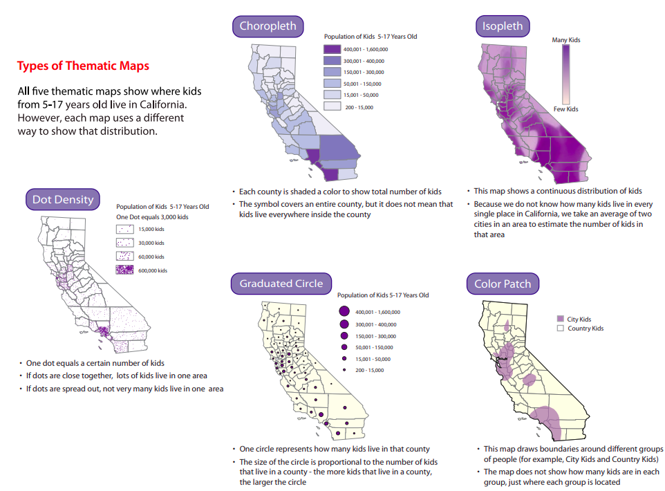

```{r setup, include=FALSE}
# clean up the environment
rm(list = ls())
# setup chunk options
knitr::opts_chunk$set(
  message = FALSE,
  warning = FALSE,
  fig.align = "center",
  class.output = ".scroll-500",
  comment = "#>"
)
options(scipen = 9999)

```


The following coursebook is the main part for _Online Data Science Series: Visualizing Geospatial Data in R_ workshop produced by the team at [**Algoritma**](http://algorit.ma/) . The coursebook is intended for a restricted audience only, i.e. the individuals having received this coursebook directly from the training organization. It may not be reproduced, distributed, translated or adapted in any form outside these individuals and organizations without permission.

[**Algoritma**](http://algorit.ma/) is a data science education center based in Jakarta. We organize workshops and training programs to help working professionals and students gain mastery in various data science sub-fields: data visualization, machine learning, data modeling, statistical inference, etc.

Before you go ahead and run the codes in this coursebook, it’s often a good idea to go through some initial setup. Under the **Training Objectives** section we’ll outline the syllabus, identify the key objectives and set up expectations for each module. Under the **Libraries and Setup** section you’ll see some code to initialize our workspace and the libraries we’ll be using for the projects. You may want to make sure that the libraries are installed beforehand by referring back to the packages listed here. 

# Preface {.tabset}

## Introduction

Geospatial data is data about objects, events, or phenomena that have a location on the surface of the earth. The data combines location information (usually coordinates on the earth), attribute information (the characteristics of the object, event, or phenomena concerned), and often also temporal information (the time or life span at which the location and attributes exist)[^1].

Geospatial analysis uses this data to build maps, graphs, statistics, and cartograms, making complex relationships understandable. It introduces a formal techniques using geographic and geometry properties of a data. There are various business problems that can be solved using geospatial analysis, namely a few:  

- Warehouse logistics optimization  
- Market growth analysis for different regions  
- Sales demand forecasting  
- Work resource management  

There are actually a plethora of tools that can visualize geographic information from full-scale GIS (Geographic Information System) applications such as [ArcGIS](https://www.arcgis.com/index.html) and [QGIS](https://qgis.org/en/site/) to web-based tools like [Google maps](http://maps.google.com/) to any number of programing languages. But, with advantages and disadvantages to these different types of tools, using a command-line interface has a steep learning curve, but it has the benefit of enabling approaches to analysis and visualization that are customizable, transparent, and reproducible[^2].

This 4-days online workshop is a beginner-friendly introduction to **Geospatial Analysis in R**. By visualizing geospatial data, users can have more intuitive decision making by contextualizing data in the real world, comparing informations across the city, state, or country.

## Training Objectives

This is the first online data science series course of _Geospatial Analysis in R_. The primary objective of this course is to provide a participant a comprehensive introduction about tools and software for visualizing a geospatial data using the popular open-source tools: R. The material will covers:

**Introductory Module:**

* **Tools Introduction**  
  + R and R Studio  
  + Open source packages  
  + Using R Markdown  
  + R Programming Basics  
* **Data Wrangling with R's `tidyverse`**  
  + Working with tabular data in R: Tips and Techniques 
  + Data Wrangling and Aggregation
  + Introduction to visualization with `ggplot2`
  
***
**Main Module:**

* **Building Indonesia Static Map**  
  - Retrieving Indonesia spatial vector from an open source provider
  - Working with spatial polygon in R
  - Grammar of Graphics for geospatial data using `ggplot2`
  - Enhancing map plots for richer visualization 
* **Creating Interactive Map**
  - Using `leaflet` - a JavaScript API for creating interactive maps
  - Adding markers and colors in `leaflet`
  - Building various geospatial analysis graphics: Heatmap, Choropleth, and Connection Map
* **Publishing your visualization**
  - Explore various publication options using `rmarkdown` versatile output 
  - Create an awesome and easy-to-build dashboard using `flexdashboard` package
  - Present your geospatial analysis for various industries business solution

## Library and Setup

In this **Library and Setup** section you’ll see some code to initialize our workspace, and the packages we’ll be using for this project. 

_Packages_ are collections of R functions, data, and compiled code in a well-defined format. The directory where packages are stored is called the _library_. R comes with a standard set of packages. Others are available for download and installation. Once installed, they have to be loaded into the session to be used. 

You will need to use `install.packages()` to install any packages that are not yet downloaded onto your machine. To install packages, type the command below on your console then press ENTER.

```{r eval=FALSE}
## DO NOT RUN CHUNK
# packages <- c("tidyverse", "maps","rgdal","tmap","sf")
# 
# install.packages(packages)
```

Then you need to load the package into your workspace using the `library()` function. Special for this course, the _rmarkdown_ packages do not need to be called using `library()`.

```{r}
# package for data wrangling & vis
library(tidyverse)
library(glue)
library(scales)

# package for spatial environment in R
library(sf)

# package for visualization
library(leaflet)
library(plotly)

```

# Geospatial Analysis in R

**Geospatial analysis**, as the main topic of this workshop, is a domain of analysis that focuses on data processing that is associated with geographic data. With unlisted potentials for many business domain analysis, in this main section of the workshop, we will try to learn the building blocks of geospatial data and combines it with a business use case example in order to visualize our data as an insightful map.

We will explore how to use and obtain geospatial data in R to create some of the most popular types of thematic maps; choropleth (static and interactive) and interactive heatmap.

## Spatial Data Types & Formats

Let's have a quick glimpse on a simple geospatial visualization in R by running the code chunk below:


```{r}
maps::map("world", fill = TRUE, col = "darkseagreen")
```
The code above projected countries around the world as a static map. But, how does geographic data information stored? How could we obtain detail information on geographic contours or territorial borders?

```{r rastervect, echo = FALSE, out.width="55%",fig.align = "center", fig.cap="Illustration on Vector vs. Raster"}
knitr::include_graphics("img/rastervector.jpg")
```

The two most widely used geographic data models for spatial data are **vector** and **raster**. A vector data represents location and shape of geographic features through geometric shapes such as points, lines and polygons. Raster data, on the other hand, consists of values within a grid system. You can imagine raster data as a pixelated digital image such as a satellite imagery or a scanned map.

There are lots of data formats that can be used to store each data model. *KML*, *GeoJSON*, *GeoTIFF*, *Tab File*, are some of the common formats you might ever came accross. However, the most common format in geographic information system mapping is the **Shapefile**.

**Shapefile** is the universal standard of geospatial format developed and regulated by [Esri](https://www.esri.com/en-us/home), the international supplier of geographic information system softwares. The type format is then adopted by so many programming languages, including R.

The name Shapefile might be a little deceptive since the file is commonly made up from these separate files: 

- `.shp` (**mandatory**): includes the geometry data.
- `.shx` (**mandatory**): includes the index data used to identify different geometries.    
- `.dbf` (**mandatory**): includes attribute information of each geometry's data.
- `.prj` includes the information of the coordinate reference system 

Other than the listed files above, a shapefile may includes other file components. A comprehensive list of shapefile components can be accessed [here](https://www.loc.gov/preservation/digital/formats/fdd/fdd000280.shtml).

For this workshop, I have provided a shapefile for Indonesian territory under `shp` folder of this directory. Notice that inside the directory, there is also a `gadm36_IDN_3.zip` which actually the original Indonesian shapefile provided by [GADM](https://gadm.org/about.html). If you go ahead to the website you can pick out different countries spatial vector. Indonesia's spatial vector is provided up to 4 levels of granularity. In this course we'll be working with 3 levels of spatial vector that contains: **Provinsi**, **Kabupaten** and **Kecamatan**.


***
**Extra Tip**:  
You can also access GADM database directly from R with the help of [`GADMTools`](https://github.com/Epiconcept-Paris/GADMTools) library:

  ```r
  # Code example to load Indonesia's spatial vector in Kabupaten/Kota level  
  library(GADMTools)  
  library(sf)  
  map <- gadm_sf_loadCountries(c("IDN"), level=2, basefile = "./")  
  plotmap(map)  
  ```

***


## R's Spatial Ecosystem

Let's read in the files using `st_read()` function from `sf` package:

```{r}
idn <- st_read(dsn = "shp", layer = "idn")
```

`sf` represents "Simple Features" as records in a data.frame or tibble with a geometry list-column[^3]. **Simple Features** is a hierarchical data model that represents a wide range of geometry types. Of 17 geometry types supported by the specification, only 7 are used in the vast majority of geographic research [^4]:

```{r geom, echo = FALSE, out.width="80%",fig.align = "center", fig.cap="Source:[Geocomputation with R](https://geocompr.robinlovelace.net/)"}
knitr::include_graphics("img/geom.png")
```

If you use the `class()` function for our newly created `idn` object you can retrieved how the `sf` class handles spatial data in similar way as any tabular data structure; by stores it as a dataframe:

```{r}
class(idn)
```

The main difference between a regular dataframe an an `sf` object is that it has `geometry` which describes where on Earth the feature is located, and they have attributes, which describe other properties:

```{r}
idn$geometry
```

To get a better idea about `geometry` information in an `sf` object, let's go ahead and plot `idn$geometry` using `plot()` function:

```{r}
plot(idn$geometry)
```

There are several informations that is stored in an `sf`'s `geometry`:

- **Geometry Type**: There are seven most common geometry types in simple feature: `POINT`, `LINESTRING`, `POLYGON`, `MULTIPOINT`, `MULTILINESTRING`, `MULTIPOLYGON` and `GEOMETRYCOLLECTION`.
- **Dimension**: Refers to a 2-(`XY`), 3-(`XYZ`/`XYM`) or 4-dimensional (`XYZM`) space. 
- **Bbox (Bounding Box)**: an area defined by two longitudes and two latitudes.
- **CRS**: Coordinate Reference System.

A CRS is a fundamental component of geospatial data. It models earth surface into a mathematical model. Intuitively, you could think of it as a way to model a 3 dimensional surfaces such as earth, into a 2 dimensional surface that is commonly used in geospatial analysis: making maps, distance calculation, etc. Take a look at the following images for better illustration:  

```{r crs, echo = FALSE, out.width="80%",fig.align = "center", fig.cap="Source:[DataCarpentry](https://datacarpentry.org/)"}
knitr::include_graphics("img/crs.jpg")
```

If we were using geospatial data from different sources, it is important to make sure the data we are using has the same CRS attribute. A different CRS would not represented in the same mathematical space if combined and would alter any calculation done on the data significantly.

## Working with Vector Attributes

The big advantage of using `sf` is how you each functions can be combined using `%>%` operator and works well with the tidyverse collection of R packages, which gives us better control over the geometry information in `sf` objects. For example, to subset certain provinces, you can use `filter()` method just like how you work with regular dataframe:

```{r}
bali <- idn %>% 
  filter(NAME_1 == "Bali")

plot(bali$geometry)
```

You can also perform aggregation operations over the geometry:

```{r}
bali_prov <- bali %>% 
  group_by(NAME_1) %>% 
  summarise()

plot(bali_prov$geometry)
```

> **Dive Deeper**

Using the same method as above, try to plot a map which shown Indonesian province of North Sumatra in the city (Kabupaten/Kota) level!

```{r}
## Your code here 

```


Other than `sf`'s simple features, there are actually other methodologies for storing model of geographical features into R. If you ever ran into a geospatial studies in R, you may also familiar with the use of `sp` package. In fact, `sp` was a very-well developed package since 2005 which practically supported almost every GIS analysis in R, even until now.

The main problem of `sp` is its low compatibility to R dataframe structure. `sf` was built to fill the gap. Released in 2016, `sf` uses OGC (Open Geospatial Consortium) & ISO standard on recording and structuring spatial data with [*simple features*](https://r-spatial.github.io/sf/articles/sf1.html). 

The disadvantage of `sf` is, since it is relatively new, some spatial packages may have not yet added support for `sf` object.  Fortunately, we can stil convert an `sf` object to spatial class used in `sp`:

```{r}
library(sp)
idn_sp <- as(idn, Class = "Spatial")

class(idn_sp)
```

Spatial objects can be converted back to `sf` in the same way or with `sf`'s `st_as_sf()` function:

```{r}
idn_sf <- st_as_sf(idn_sp)

class(idn_sf)
```

***
**Notes**:

If you want to learn more about `sp` and how to work with spatial data using `sp` ecosystem, you can refer to "`sp-example.Rmd`" in this directory.

***

# Hands On: Jakarta House Pricing Distribution

## Data Preprocessing

Now let's head back to our `listings.csv`, a data consists of properties listed for sale in Jabodetabek area:

```{r}
df <- read.csv("data/listings.csv")
head(df)
```
Here, we want to compare the house pricing for each sub-district (`Kecamatan`) level. Since the size of the listed properties may vary, we'll use the price per square meter instead:

```{r}
df_agg <- df %>% 
  mutate(
    harga_m2 = harga / m2
  ) %>% 
  group_by(kota, kecamatan) %>% 
  summarise(harga_m2 = median(harga_m2),
            total_listings= n()) %>% 
  ungroup()

head(df_agg)
```

To project our `housing` data into a map, we need to equip each observation in the data with geographical information representation. We can do this by joining the information of the city (`kota`) & sub-district (`kecamatan`) to `NAME_2` & `NAME_3` variables respectively in `idn`: 

```{r}
idn %>% 
  as.data.frame() %>% 
  head()
```
To join two dataframes in R, we can use the `*_join()` function from `dplyr` package:

```{r}
df_agg <- df_agg %>% 
  left_join(idn, by = c("kota" = "NAME_2", "kecamatan" = "NAME_3"))

head(df_agg)
```
Now that our `df_agg` data have the geographic attributes attached, we can turn it into an `sf` object using `st_as_sf()` function:

```{r}
df_agg <- st_as_sf(df_agg)

df_agg$geometry
```

## Building Maps in R

### Creating Maps with `ggplot2`

R is loaded with built-in tools and open source packages to help us turning both `sp` and `sf` objects into a neat map visualization. In the first session of this workshop, you have learned about a widely used and powerful plotting library for R, `ggplot2`. The great thing is that `ggplot` can plot `sf` objects directly by using `geom_sf`. 

Recall about the `ggplot2` layering system and see the code below:

```{r}
ggplot(df_agg)+ # add base canvas
  geom_sf() # plot the geometry
```
You can also easily map the color of `harga_m2` by adding the variable inside the `aes()` in the geom element:

```{r}
ggplot(df_agg)+
  geom_sf(aes(fill = harga_m2)) 
```

> **Dive Deeper**

Recall how you can use `labs()` in ggplot to add label informations, such as title, subtitle, etc. Copy down the previous code above, and provide the map with appropriate labellings on the chunk below!

```{r}
## Your Code Here

```


With small adjustments and feature additions, we have built a nice geographic representation of house pricing in Jakarta. Notice that in the chunk below, I added a layer of `theme_algo_map()`, which was a customized map I created for this workshop. (You can also create your own theme too!)

The modularity of `ggplot2` also allows us to save it as an external file, makes it easy for us to make a reproducible custom theming. You can find the code for `theme_algo_map()` under `assets/theme_algo.R`.

```{r}
source('assets/theme_algo.R')

plot <- ggplot(df_agg)+
  geom_sf(aes(fill = harga_m2)) +
  labs(title = "Distribusi Harga Rumah di Jabodetabek",
       subtitle = "Hasil sample harga di marketplace properti",
       caption = "Sample menggunakan ±10,000 listing rumah di laman jual-beli rumah OLX\n September 2020",
       fill = "Harga/m2")+
  scale_fill_gradient(low = "lavenderblush", high = "red3",
                      labels = number_format(scale = 1/1e6, suffix = " Jt.", accuracy = 1))+
  theme_algo_map()

plot
```
Another benefit of creating maps with `ggplot2` is how we can easily add a level of interactivity by simply use `ggplotly()` function from the plotly package. 

Since we have stored our most recent plot creation as an object named `plot`, let's try to wrap it with `ggplotly(plot)`.

(*P.S. If you haven't install the plotly package, you can run `install.packages("plotly")` through your console*)

```{r}
ggplotly(plot)
```

You can also add another adjustments such as customizing the tooltip and hide the mode bar for cleaner appearance:

```{r}
# create new column to store the tooltip information
df_agg <- df_agg %>% 
  mutate(text = glue("{kecamatan}, {kota}: <br> {number(harga_m2, scale = 1/1e6, suffix = 'Jt.', accuracy = .01)}"))

# re-run the function to create plot
plot <- ggplot(df_agg, aes(text = text))+ # add new aes mapping: text to define the tooltip text
  geom_sf(aes(fill = harga_m2)) +
  labs(title = "Distribusi Harga Rumah di Jabodetabek",
       subtitle = "Hasil sample harga di marketplace properti",
       caption = "Sample menggunakan ±10,000 listing rumah di laman jual-beli rumah OLX\n September 2020",
       fill = "Harga/m2")+
  scale_fill_gradient(low = "lavenderblush", high = "red3",
                      labels = number_format(scale = 1/1e6, suffix = " Jt.", accuracy = 1))+
  theme_algo_map()


# re-run the `ggplotly`
ggplotly(plot, tooltip = "text") %>% # define tooltip
  config(displayModeBar = F) # hide the modebar
```


> **Dive Deeper**

Using the same method as above, try to create a map that represent the number of listed properties(`total_listings`) in each sub-district. Once you're done, you can also try to customize your own map appearance!

```{r}
## Your code here

```


### Interactive Mapping with `leaflet`

Among all available mapping packages in R, `leaflet` has became the most widely used for building interactive maps in R. It provides a relatively low-level interface to the Leaflet JavaScript library. The full documentation of the package can be accessed [here](https://rstudio.github.io/leaflet/). 

Taken from its official documentation[^5], to create a Leaflet map we can follow these basic steps:

1. Create a map widget by calling `leaflet()`.
2. Add layers (i.e., features) to the map by using layer functions (e.g. `addTiles`, `addMarkers`, `addPolygons`) to modify the map widget.
3. Repeat step 2 as desired.
4. Print the map widget to display it.

Now, let's follow the steps above to recreate the previous choropleth as a Leaflet map.

```{r}
# leaflet
leaflet(df_agg) %>% # create map widget
  addTiles() %>% # add basemap
  addPolygons() # add polygons from `sf` data %
```

By default, `addTiles()` used tiles from [OpenStreetMap](https://www.openstreetmap.org/). We can also use third-party basemaps by using `addProviderTiles()` instead. The lists of complete set basemaps provided by `leaflet-providers` can be found [here](http://leaflet-extras.github.io/leaflet-providers/preview/index.html).

```{r}
# list of available provider tiles
names(providers)
```


To access the supported tile providers, we can also use`providers$` and choose from the options:

```{r}
leaflet(df_agg) %>% 
  addProviderTiles(providers$Esri.NatGeoWorldMap) %>%  
  addPolygons()
```

Let's now color the polygons based on the house pricing. First, we need to create a color palette to represent the data. In the chunk below, we create an object called `pal` which stores the colors generated from `df_agg$harga_m2` values. The value passed to fill in `palette` is provided by [ColorBrewer2](https://colorbrewer2.org/#type=sequential&scheme=BuGn&n=3) palettes.

Notice that on the next line, inside the `addPolygons()` function call, we also add some parameters:

- `fillColor`: the values and palette to be mapped
- `fillOpacity`: the `fillColor` opacity
- `weight`: thickness of the mapped polygons
- `color`: color of the mapped polygons

```{r}
pal <- colorNumeric(palette = "Reds", domain = df_agg$harga_m2)

leaflet(df_agg) %>% 
  addProviderTiles(providers$Esri.NatGeoWorldMap) %>%  
  addPolygons(
    fillColor = ~pal(harga_m2),
    fillOpacity = .8,
    weight = 2,
    color = "white"
  )

```

To add more interaction to our map, we can also make the polygons highlight as the mouse passes over them. We can do it by defining the `highlight` argument inside the `addPolygons()` function:

```{r}
leaflet(df_agg) %>% 
  addProviderTiles(providers$Esri.NatGeoWorldMap) %>%  
  addPolygons(
    fillColor = ~pal(harga_m2),
    fillOpacity = .8,
    weight = 2,
    color = "white",
    highlight = highlightOptions(
      weight = 5,
      color = "black",
      bringToFront = TRUE,
      opacity = 0.8
    )
  )
```


Now let’s also add labels information as we hover over each sub-district mapped. To add the label, we need to create a HTML object using `htmltools::HTML` which stores the value of information we desired to be shown:

```{r}
labels <- glue::glue("
  <b>{df_agg$kecamatan}, {df_agg$kota}</b>:<br> {round(df_agg$harga_m2/1e6, 2)} jt/m2"
) %>% lapply(htmltools::HTML)
```

Then, to map it, we can add `label` argument inside the `addPolygons()` function.

```{r}
leaflet(df_agg) %>% 
  addProviderTiles(providers$Esri.NatGeoWorldMap) %>%  
  addPolygons(
    label = labels,
    fillColor = ~pal(harga_m2),
    fillOpacity = .8,
    weight = 2,
    color = "white",
    highlight = highlightOptions(
      weight = 5,
      color = "black",
      bringToFront = TRUE,
      opacity = 0.8
    )
  )
```

As the final step, we might also need to add a legend to give information about the colors and intervals. To add the legend, we only a layer of `addLegend()` function:

```{r}
leaflet(df_agg) %>% 
  addProviderTiles(providers$Esri.NatGeoWorldMap) %>%  
  addPolygons(
    label = labels,
    fillColor = ~pal(harga_m2),
    fillOpacity = .8,
    weight = 2,
    color = "white",
    highlight = highlightOptions(
      weight = 5,
      color = "black",
      bringToFront = TRUE,
      opacity = 0.8
    )
  ) %>% 
  addLegend(
    pal = pal,
    values = ~harga_m2,
    opacity = 1,
    title = "Harga/m2",
    position = "bottomright"
  )
```


> **Dive Deeper**

1. Suppose we want to create a border to separate areas under the Jakarta Area. Recall how you can perform aggregation over the vector attributes and fill down the code skeleton (`______`) below to get the geometry for our Jakarta border!
```r
# Copy down this code to the chunk below:

border  <- df_agg %>% 
  filter( ______== ______) %>% 
  group_by(______) %>% 
  ______() 

```
```{r}
## Your code here

```

2. Now that you have stored the border information, add another layer on our most recent mapping code to map the border of Jakarta area. Again, you can use the skeleton below to prepare the layer you need:
```r
addPolylines(
    data = ______,
    color = "darkred",
    opacity = .8,
    weight = 2.5
  )
```

```{r}
## Your code here

```

3. Once your done, feel free to modify the code elements to create your own map customization. For your reference, you can go to leaflet for R's documentation [here](https://rstudio.github.io/leaflet)!

```{r}
## Your code her


```


***

**Complete Code**:


```{r}
pal <- colorNumeric(palette = "Reds", domain = df_agg$harga_m2)

labels <- glue::glue("
  <b>{df_agg$kecamatan}, {df_agg$kota}</b>:<br> {round(df_agg$harga_m2/1e6, 2)} jt/m2"
) %>% lapply(htmltools::HTML)

border  <- df_agg %>% 
  filter(NAME_1 == "Jakarta Raya") %>% 
  group_by(NAME_1) %>% 
  summarise() 

leaflet(df_agg) %>% 
  addProviderTiles(providers$Esri.NatGeoWorldMap) %>%  # using `addProviderTiles()` instead of `addTiles()`
  addPolygons(
    label = labels,
    labelOptions = labelOptions(
      style = list(
        "font-size"="13px",
        "background-color"="black",
        "color"="white"
      )
    ),
    weight = 2,
    color = "white",
    fillOpacity = .8,
    fillColor = ~pal(harga_m2),
     highlight = highlightOptions(
    weight = 5,
    color = "black",
    bringToFront = TRUE,
    sendToBack = TRUE,
    opacity = 0.8)
  ) %>% 
  addPolylines(
    data = border,
    color = "darkred",
    opacity = .8,
    weight = 2.5
  ) %>% 
  addLegend(
    pal = pal,
    values = ~harga_m2,
    opacity = 1,
    title = "Harga/m2",
    position = "bottomright"
  ) %>%
  fitBounds(106.686211, -6.370783, 106.972824, -6.089036)
```

# More Thematic Maps

In general, spatial data can be represented either as **reference maps** or **thematic maps**. While reference maps emphasizes the location of objects in the world, thematic maps shows the spatial variability of a specific distribution. The house pricing distribution map we created earlier is among the most frequently used thematic map types in geospatial data, which is the **Choropleth map**.

```{r thematic-map, echo = FALSE, out.width = '100%',fig.align = "center", fig.cap="Source: [Mapping Ideas from Cyberspace to Realspace](http://mappingideas.sdsu.edu/CaliforniaAtlas/atlas/pages/10_types_of_maps.pdf)"}

```
As an example, let's take a look at this dataset of Perumahan (housing estate) locations in Jakarta area:

```{r}
perum <- read.csv('data/perumahan.csv')
head(perum)
```

Let's try to create a dot density map using `leaflet`'s `addCircles()` function:

```{r}
leaflet(perum) %>% 
  addTiles() %>% 
  addCircles(label = ~perumahan)
  
```

Another common way of representing geographical density map is by using a heatmap. To create a heatmap in leaflet, we can use `leaflet.extras` package:

```{r}
library(leaflet.extras)

leaflet(perum) %>% 
  addTiles() %>%
  addCircles(
    label = ~perumahan,
    color = "red"
  ) %>% 
  addHeatmap(
    radius = 10
  ) 
```

# [Optional:] Other Mapping Packages

Geospatial mapping is an active area in R community, which makes R loaded with many other packages that supported spatial visualization. Packages like `cartography`, `mapview`, `ggspatial`, `rasterVis` and many other libraries that you can explore. Other than `ggplot2` and `leaflet` that we used in this workshop, `tmap` is also one of the most popular package used to create both static and interactive maps in R.

`tmap` also works similarly with `ggplot2`, since it is also based on the idea of Grammar of Graphics[^6]:

```{r}
library(tmap)

tm_shape(df_agg)+
  tm_polygons("harga_m2")
```
Just like how you can use facets in `ggplot2`, you can also create it with `tm_facets()`, for example, to split our map based on each city:

```{r}
tm_shape(df_agg) +
    tm_polygons("harga_m2") +
    tm_facets(by = "kota")
```
`tmap` also has a nice feature that allows us to add interactivity by switching from "plot" to "view" mode like so:

```{r}
tmap_mode("view")

tm_shape(df_agg)+
  tm_polygons("harga_m2") +
  tm_bubbles("total_listings")
```

# Publishing your Map


# References
[^1]: [Kristin Stock, Hans Guesgen, in Automating Open Source Intelligence, 2016](https://www.elsevier.com/books/T/A/9780128029169)
[^2]: [Edzer Pebesma, Daniel Nüst, and Roger Bivand, “The R Software Environment in Reproducible Geoscientific Research,” Eos 93 (2012): 163–164.](https://agupubs.onlinelibrary.wiley.com/doi/abs/10.1029/2012EO160003)  
[^3]: [Edzer Pebesma, Roger Bivand, Spatial Data Science](https://keen-swartz-3146c4.netlify.app/)
[^4]: [Robin Lovelace, Jakub Nowosad, Jannes Muenchow, "Geocomputation with R"](https://geocompr.robinlovelace.net/spatial-class.html)
[^5]: [Leaflet for R](https://rstudio.github.io/leaflet/)
[^6]: [Wilkinson, Leland, and Graham Wills. 2005. The Grammar of Graphics. Springer Science+ Business Media.](https://www.springer.com/de/book/9780387245447)
